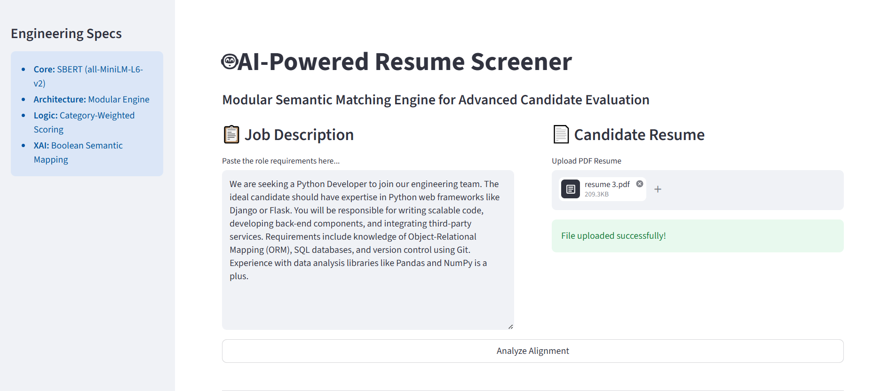
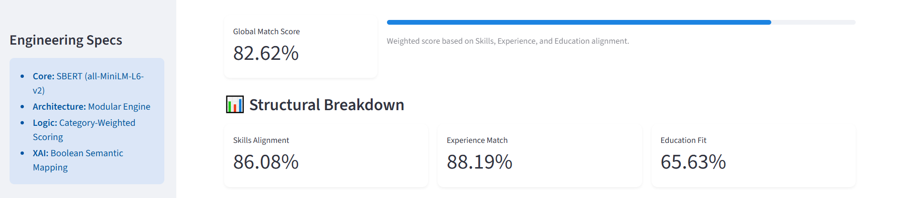
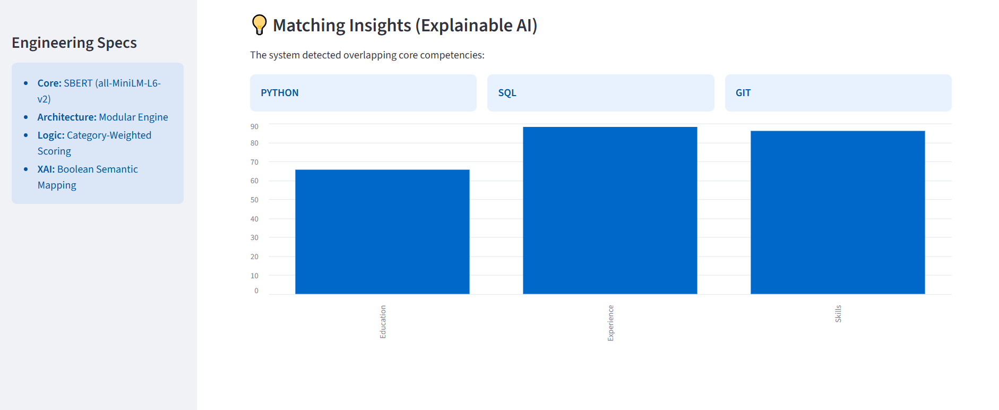

# AI-Powered Resume Screener
**An intelligent recruitment tool that uses Natural Language Processing (NLP) to understand the semantic meaning of resumes.**






## Project Overview
Traditional Resume Screeners (ATS) often fail because they only look for exact keyword matches. This project uses **Machine Learning** to perform **Semantic Analysis**, allowing the system to understand that different words can have the same meaning (e.g., "Web Development" and "Frontend Engineering").

## Key Features
- ✅ **Contextual Matching:** Uses AI embeddings to find the best candidates beyond simple keywords.
- ✅ **Skill Insights:** Automatically extracts and highlights matching technical skills from the text.
- ✅ **PDF Parsing:** Built-in support for reading and analyzing professional PDF resumes.
- ✅ **Interactive UI:** A clean, modern dashboard built with Streamlit.

## The Technology
- **AI Model:** `all-MiniLM-L6-v2` (Transformer-based Sentence Embeddings)
- **Framework:** Streamlit (Frontend & Dashboard)
- **Libraries:** PyTorch, Sentence-Transformers, PyMuPDF, Pandas
- **Algorithm:** Cosine Similarity for high-dimensional vector matching

## How to Run Locally
1. **Clone the repository:**
   ```bash
   git clone https://github.com/arwa-ayub/AI-Resume-Screener.git

2. **Install Dependencies"**
   pip install -r requirements.txt

3. **Launch the app:**
   python -m streamlit run app.py
   ```